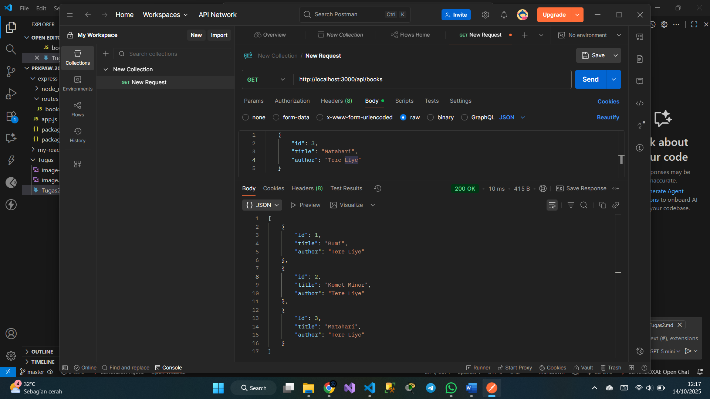
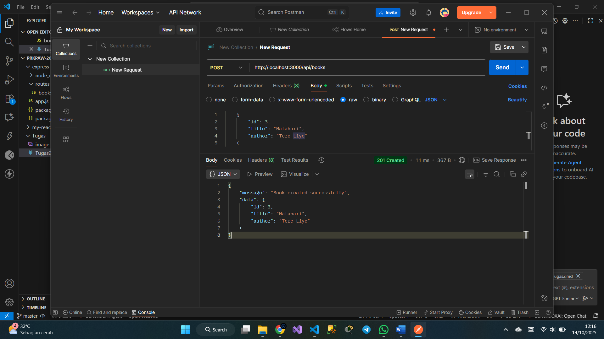
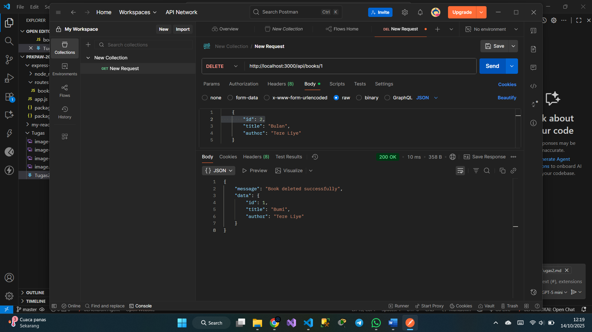
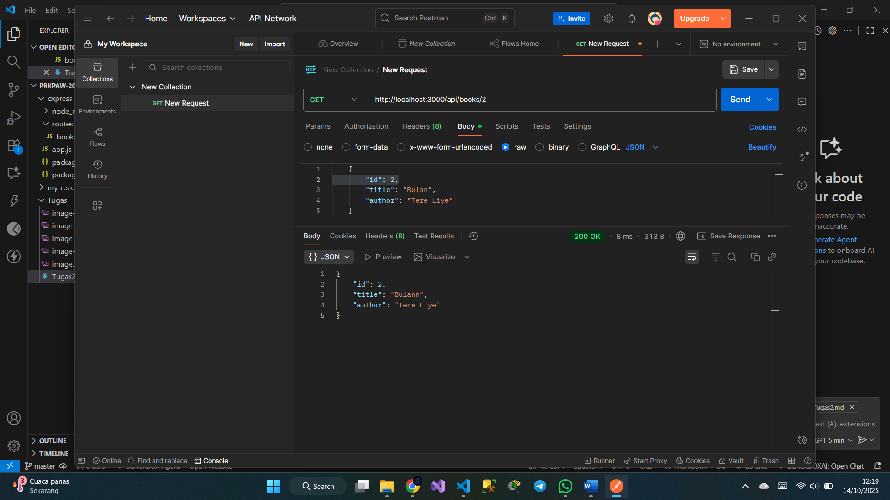

# Tugas 2

## Tampilan endpoint read book (GET)

## Tampilan endpoint create book (POST)

## Tampilan endpoint update book (PUT)

## Tampilan endpoint delete book (DELETE)

## Tampilan GET by ID
