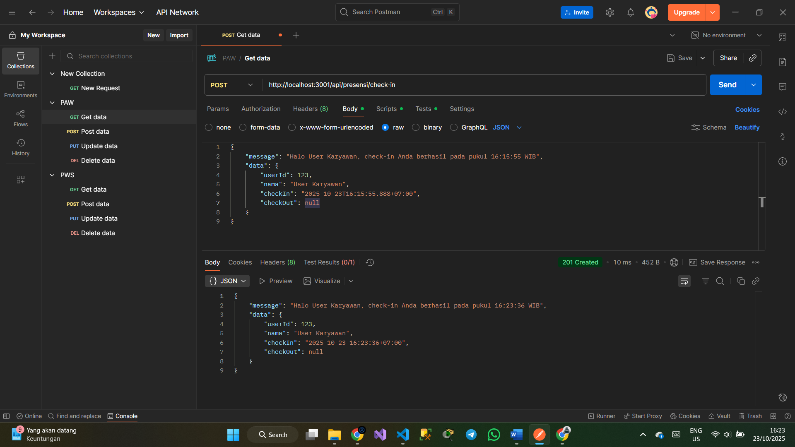
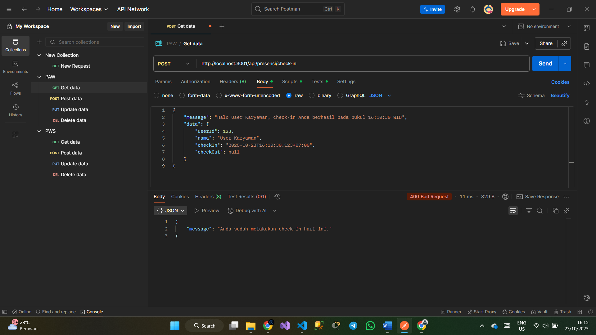
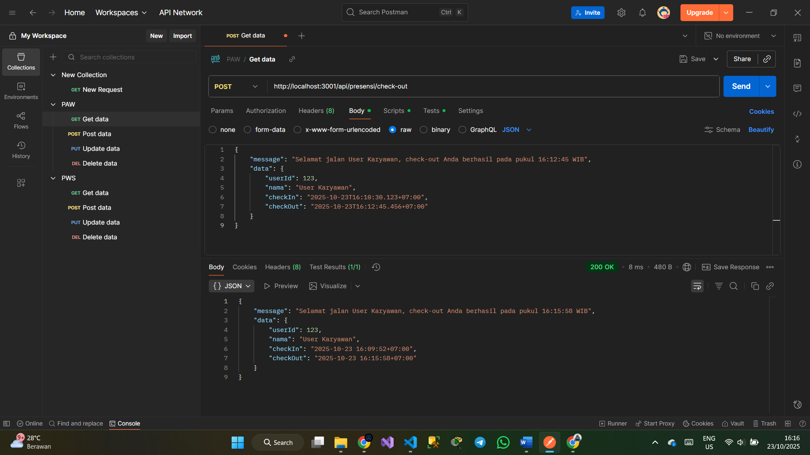
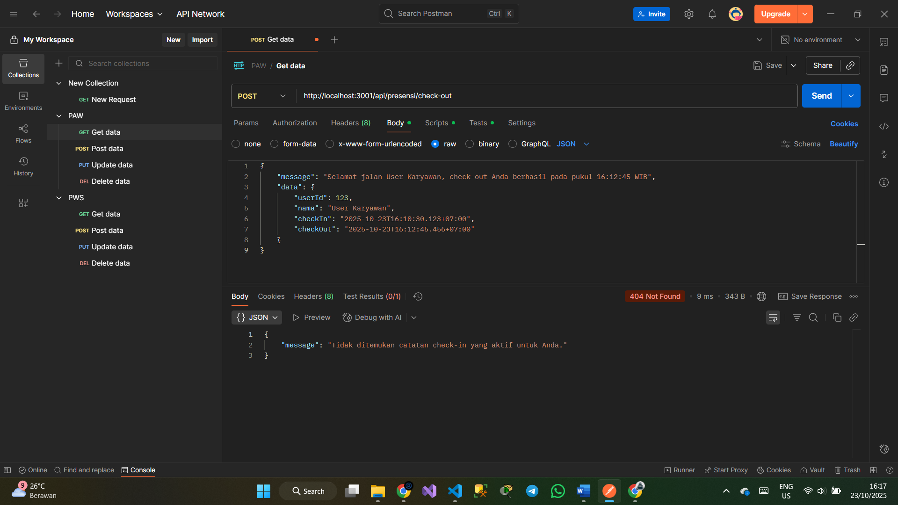
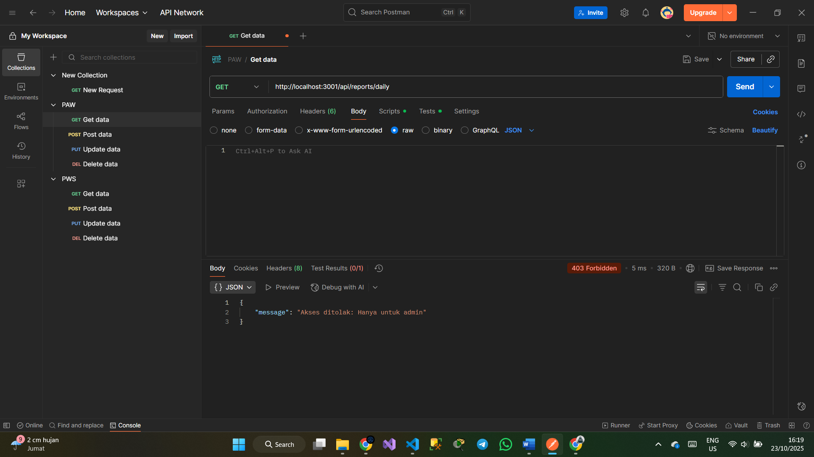

# Tugas 3

## Tampilan endpoint berhasil presensi/checkin (POST)

## Tampilan endpoint presensi/checkin lebih dari 1 kali (POST)

## Tampilan endpoint berhasil presensi/check out (POST)

## Tampilan endpoint presensi/check out tapi belum check in (POST)

## Tampilan endpoint akses ditolak role karyawan bukan admin (GET)
