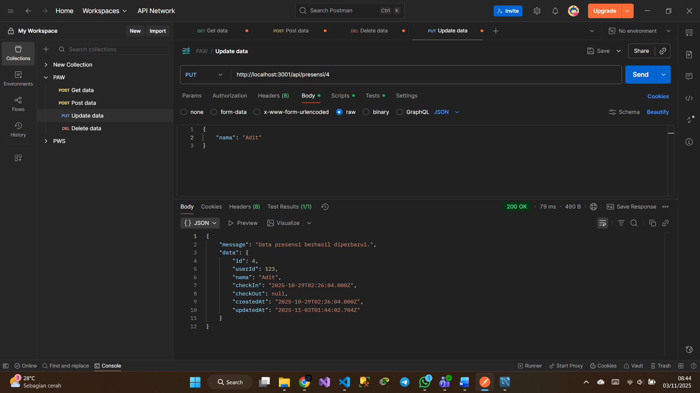
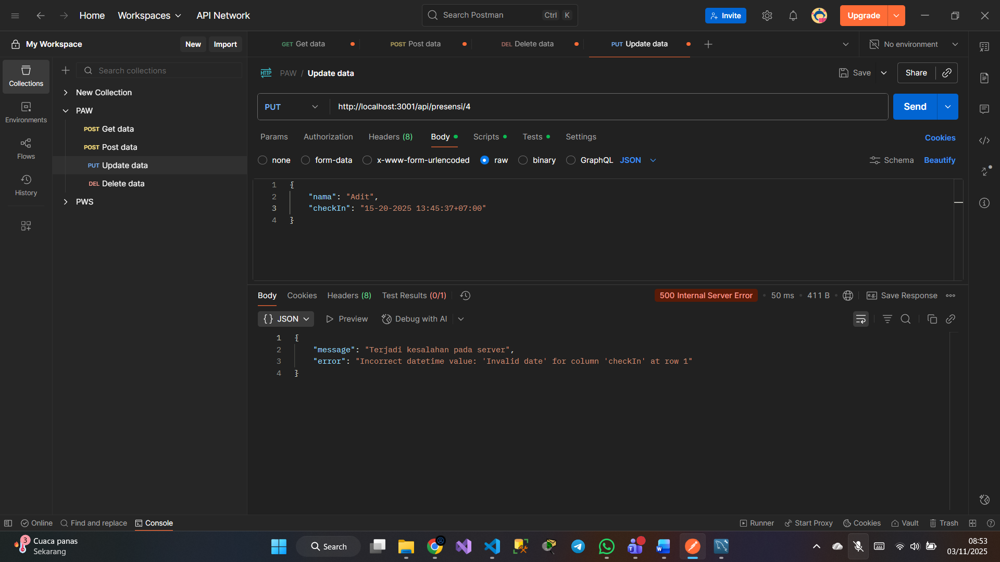
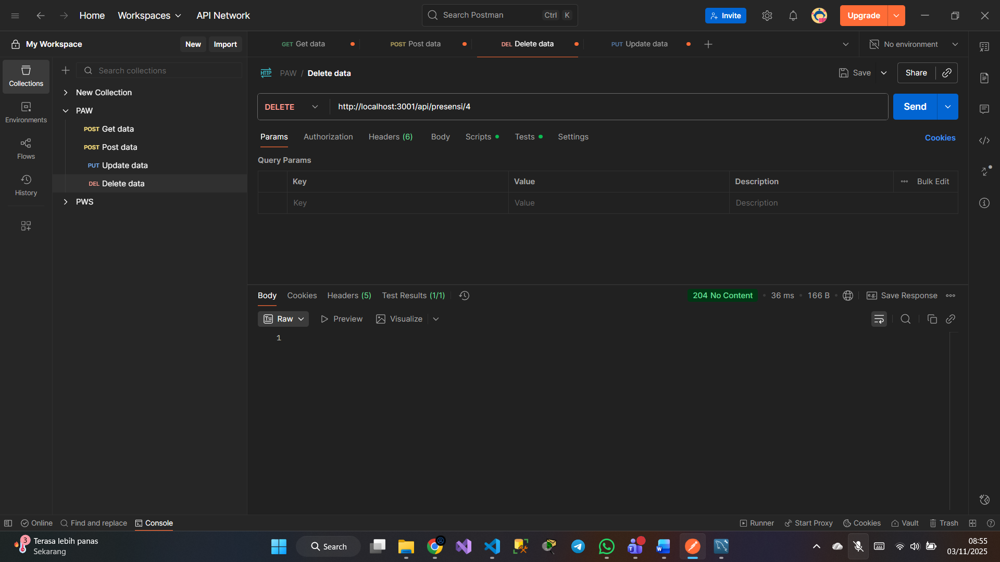
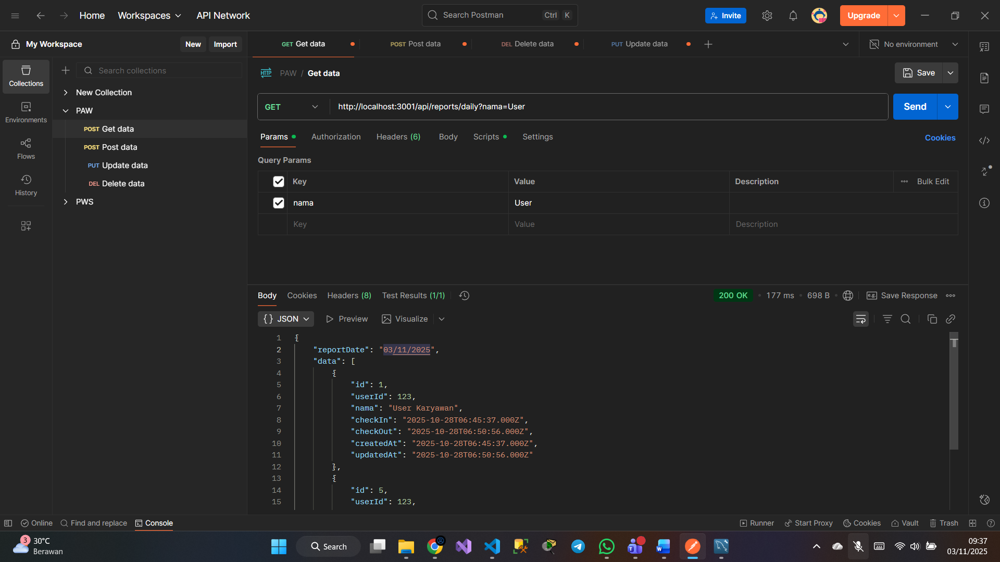
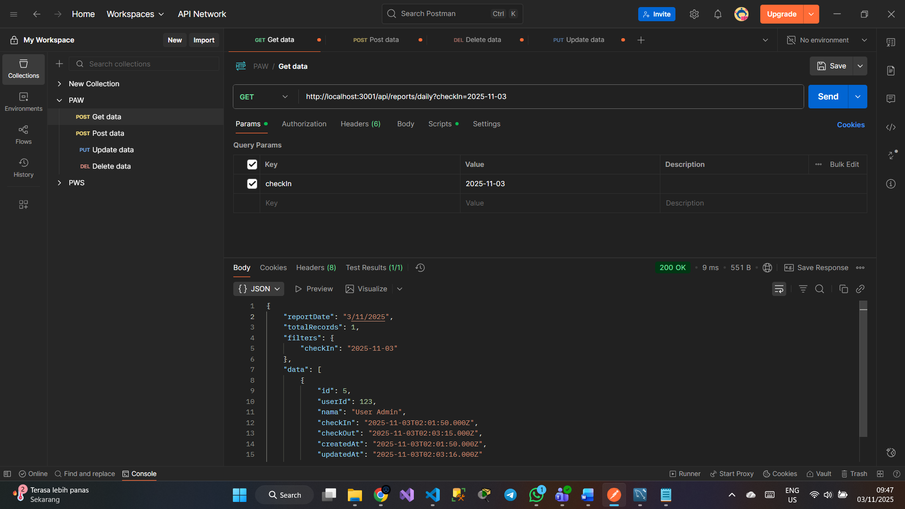

## Tugas 5

## Tampilan endpoint berhasil update data (PUT)

## Tampilan endpoint tidak valid saat update data (PUT)

## Tampilan endpoint berhasil delete data (Delete)

## Tampilan endpoint berhasil Enpoint search berdasarkan nama (GET)

## Tampilan endpoint berhasil Enpoint search berdasarkan tanggal checkIn dan checkOut (GET)
